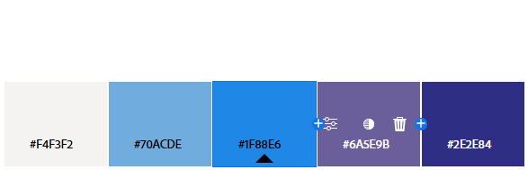
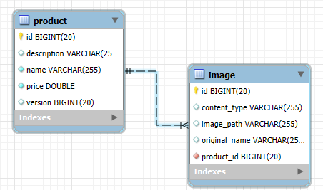

# 🏢 Car Like a Friend

Aplicación web para el alquiler de vehículos. Permite a los usuarios registrarse, explorar diferentes tipos de vehículos, hacer reservas, y dejar favoritos. Los Administradores de la aplicación pueden gestionar productos, categorías y servicios.

**Estado:** **En Desarrollo**

Este proyecto se encuentra actualmente en estado de desarrollo activo, y la versión final todavía no está disponible.

**Características principales:**
* Estructura básica del sitio.
* Funcionalidades de registro, visualización y eliminación de productos.

**Próximos pasos:**
* Implementar la estructura básica del login y registro de usuario, así cómo implementar el detalle de producto. 
* Realizar pruebas unitarias y de integración.

---

## Logo and Color Reference


| Color             | Hex                  |
| Example Color     | ![#F4F3F2] #F4F3F2 |
| Example Color     | ![#70ACDE] #70ACDE |
| Example Color     | ![#1F88E6] #1F88E6 |
| Example Color     | ![#6A5E9B] #6A5E9B |
| Example Color     | ![#2E2E84] #2E2E84 |



---

## ⚙️ Tecnologías

### 🖥️ Frontend
- React 19 + Vite
- Bootstrap 5 CSS
- React Router

### ☕ Backend
- Java 17
- Spring Boot 3.5.x
- Spring Data JPA
- MySQL

---

## 🚀 Instalación local

### 🧩 Requisitos previos
- Node.js 20+
- Java 17+
- MySQL

### 📦 Cloná el repositorio
```bash
git clone https://github.com/JB-Save/carlikeafriend-app.git
cd carlikeafriend-app
```

---

### 📁 Backend (`/carlikeafriend-backend`)

```bash
cd carlikeafriend-backend
```

#### Configurar base de datos:
```sql
CREATE DATABASE carlikeafriend-db;
```
#### Correr el backend:
```bash
./mvnw spring-boot:run
```
> El Backend estará disponible en `http://localhost:8080`
---

### 🖼️ Frontend (`/carlikeafriend-frontend`)

```bash
cd carlikeafriend-frontend
npm install
```
#### Correr el frontend:
```bash
npm run dev
```
> La aplicación estará disponible en `http://localhost:5173`
---

## 📬 Endpoints (API REST)

| Método    | Endpoint                         | Descripción                           | Auth |
|-----------|----------------------------------|---------------------------------------|------|
| GET       | /carlikeafriend/products         | Listado de productos                  | ❌   |
| GET       | /carlikeafriend/products/{id}    | Detalle del producto                  | ❌   |
| POST      | /carlikeafriend/auth/register    | Registro de usuario                   | ❌   |
| POST      | /carlikeafriend/auth/login       | Login y generación de JWT             | ❌   |
| POST      | /carlikeafriend/products         | Crear producto                        | ✅ (ADMIN) |
| PUT       | /carlikeafriend/products/{id}    | Actualizar producto                   | ✅ (ADMIN) |
| DELETE    | /carlikeafriend/products/{id}    | Eliminar producto                     | ✅ (ADMIN) |

---

## 🗂️ Diagrama de Entidades (ER)



> Creado con [MySQL Workbench]

---

## 🧪 Testing

### Backend
- Tests unitarios con JUnit y Mockito.

```bash
./mvnw test
```

### Frontend
- Testing con Vitest + React Testing Library

```bash
npm run test
```

---

## 👤 Autores

- [@JB-Save](https://github.com/JB-Save)

---

## 📄 Licencia
MIT
---

## 📞 Soporte
¿Encontraste un bug o tienes una sugerencia?

- 🐛 Reportar bug
- 💡 Solicitar feature
- 📧 Email: jasb5787@gmail.com